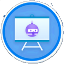

  

<h3 align="center">A passionate Computer Science student from Morocco</h3>

  

- 🔭 I’m currently working on my **tic-tac-toe game**

- 🌱 I’m currently learning **React**, **JS**, **Vite**

- 👯 I’m looking to collaborate on **nothing**

- 🤝 I’m looking for help with **everything**

- 👨‍💻 All of my projects are available here

- 💬 Ask me about **nothing**

- 📫 How to reach me **qaisariayman@gmail.com**

- ⚡ Fun fact **I still don't know what I am doing**

<h3 align="left">Connect with me:</h3>

<h3 align="left">Acheavments:</h3>

<h3 align="left">Languages and Tools:</h3>

          

<!--

  <h2>⚡ Stats ⚡</h2>
  
  

  <h2>🐍 My Contributions 🐍</h2>
   
  
     

-->

  <h2>⚡ Stats ⚡</h2>
  

    
    
  

  <h2>🐍 My Contributions 🐍</h2>
  

<!--
**qaisari/qaisari** is a ✨ _special_ ✨ repository because its `README.md` (this file) appears on your GitHub profile.

Here are some ideas to get you started:
(https://git.io/streak-stats)
- 🔭 I’m currently working on ...
- 🌱 I’m currently learning ...
- 👯 I’m looking to collaborate on ...
- 🤔 I’m looking for help with ...
- 💬 Ask me about ...
- 📫 How to reach me: ...
- 😄 Pronouns: ...
- ⚡ Fun fact: ...
-->
